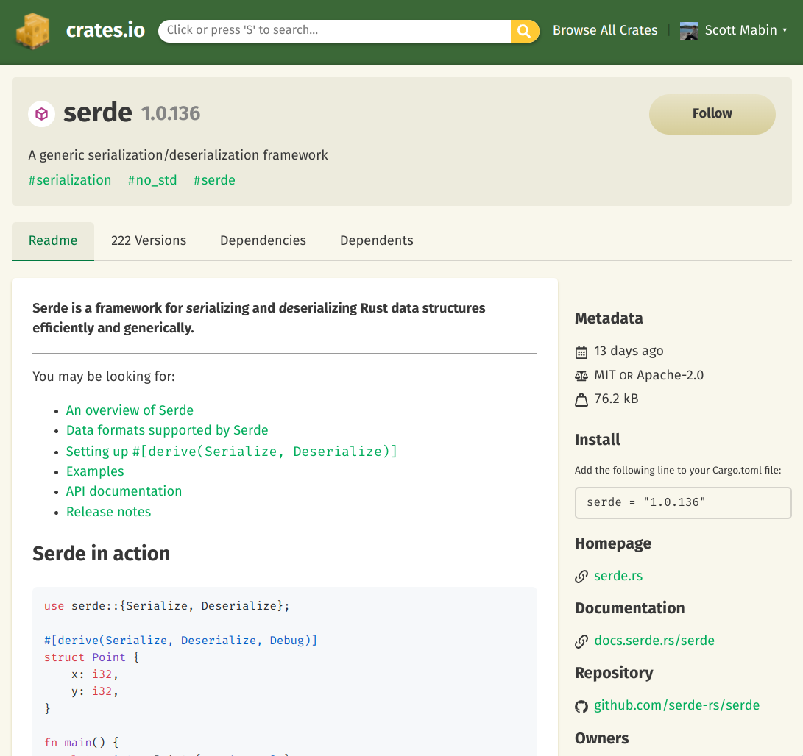

<!-- _class: lead -->
# Rust Introduction
## Scott Mabin

# Background on Rust

- Rust is a systems programming language with the slogan "fast, reliable, productive: pick three."
- 1.0 release back in 2015
- 6 week release cycle

# Why Rust?

- Eliminates a whole class of memory and syncronization bugs at compile time
- Imperative language, but with functional elements
- Package management with Cargo, and a rich ecosystem of crates

# What is a crate?

- Synonymous with a library/project
- Two types
  - binary crate - application or project
  - library crate

# Cargo

- Manages the download and compilation of crates in a project
- Default repository is [crates.io](https://crates.io/), but allows custom repositories
- Functionality can be extended

# How a Rust project is structured

```
├── Cargo.lock
├── Cargo.toml
├── src/
│   ├── lib.rs
│   ├── main.rs
│   └── bin/
│       ├── named-executable.rs
│       ├── another-executable.rs
│       └── multi-file-executable/
│           ├── main.rs
│           └── some_module.rs
├── benches/
│   ├── large-input.rs
│   └── multi-file-bench/
│       ├── main.rs
│       └── bench_module.rs
├── examples/
│   ├── simple.rs
│   └── multi-file-example/
│       ├── main.rs
│       └── ex_module.rs
└── tests/
    ├── some-integration-tests.rs
    └── multi-file-test/
        ├── main.rs
        └── test_module.rs
```


# Hello world in Rust

```rust
//! main.rs
fn main() {
  println!("Hello world!")
}
```

# Using a external library

For example, adding `serde` to our application.

```toml
# Cargo.toml
[dependencies]
serde = "1.0.136"
```
Then to use it.
```rust
//! main.rs
use serde;
```


# Writing Rust code
<!-- _class: lead -->

# Ownership

- Fundamental set of rules that governs how a Rust program manages memory.
- Applies to both stack and heap.

# Ownership

The three ownership rules:

- Each value in Rust has a variable that’s called its owner.
- There can only be one owner at a time.
- When the owner goes out of scope, the value will be dropped.

# Ownership - Example

```rust
let s1 = String::from("hello"); // s1 owns the string
let s2 = s1; // s1 transfers ownership to s2, leaving s1 empty
```

```rust
println!("{}, world!", s1); // try to use s1 and we'll get a compile error
```

```rust
error[E0382]: borrow of moved value: `s1`
 --> src/main.rs:5:28
  |
2 |     let s1 = String::from("hello");
  |         -- move occurs because `s1` has type `String`, which does not implement the `Copy` trait
3 |     let s2 = s1;
  |              -- value moved here
4 | 
5 |     println!("{}, world!", s1);
  |                            ^^ value borrowed here after move

For more information about this error, try `rustc --explain E0382`.
error: could not compile `ownership` due to previous error
```

# Ownership - `Copy` types

The error on the previous slide talks about a type not being `Copy`. Simply put, if an `Struct` or `Enum` is `Copy`, it means it's safe to do a bitwise memcopy to duplicate the value.

Example of a `Copy` type are integers.

```rust
let x = 5; // x owns the integer with value of 5
let y = x; // integer is copy, so x is copied bit for bit into y
```

```rust
println!("(x,y) = ({},{})", x,y); // compiles fine
```

# Ownership - `Copy` types

Why is `String` not copy? Well a `String` is just a `Vec` but with the guarentee that all the bytes inside are valid UTF8. Let's look at the memory layout of `Vec`.

```rust
struct Vec<T> {
    ptr: NonNull<T>,
    cap: usize,
    _marker: PhantomData<T>,
}
```

We can see we have a pointer to some memory (on the heap), and a capacity. If we were to do a bitwise copy of our `Vec` structure we'd have two objects with mutable access to the same heap memory! Not good!

# Ownership  - `Clone`

For us to duplicate a `String` we'd need some special behavior. This is where `Clone` comes in. `Clone` is a trait (more on those later!) that allows us to define what to do when we want to duplicate a `Struct` or `Enum`.

The `Clone` implementation for a `String` allocates _new_ memory on the heap with the same capacity, copies the bytes from the current allocation into the new memory and finally returns the new `String`.


# Links

- [esp-idf](https://github.com/espressif/esp-idf)
- [The esp book](https://esp-rs.github.io/book/)
- [esp-rs organisation](https://github.com/esp-rs)
- [esp-rs roadmap](https://github.com/orgs/esp-rs/projects/1)
