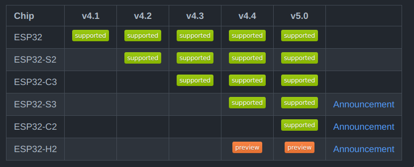
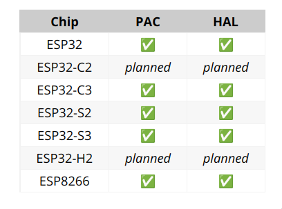

<!-- _class: lead -->
# Rust on Espressif chips
## Scott Mabin

<!-- TODO a bit about myself? -->

# What I'll cover today

- What Rust is?
- Why we're adopting it at Espressif?
- What you can do right now with Rust and Espressif chips?
- What's the plan going forward?

# Background on Rust

- Rust is a systems programming language with the slogan "fast, reliable, productive: pick three."
- 1.0 release back in 2015
- 6-week release cycle
- Previously governed by Mozilla, but is now managed by an independent non-profit organization, the Rust Foundation. 

# Why Rust?

- It's fast, compiling down to machine code just like C
  - Memory is deallocated as it goes out of scope, no garbage collection is required.
- Eliminates a whole class of memory and synchronization bugs at compile time
  - In 2019 Microsoft announced that over 70% of CVEs in the last 12 years related to their system-level software (written in C or C++) were memory safety bugs.
- Package management with `cargo` which is similar to the esp-idf component manager, but supports the entire language.
- Imperative language, but with strong functional elements

# Why Rust at Espressif?

- We see it as an emerging language in the embedded (and tooling) space
- We expect to be able to write new parts of esp-idf in Rust
- We expect to rewrite certain parts of esp-idf where Rust's safety guarantees can help
- Vast & diverse open source ecosystem
- Package management

<!-- SPEAKER NOTES
  - Mention component manager as something we've had to develop to aid users for esp-idf
 -->

# Why Rust for embedded?

- Memory safety is even more important, most embedded systems do not have an MMU
- Native `async` support, more on this later
- Separation of core library & standard library
- Package management helps foster an open source ecosystem 
  - Interface trait crates like [`embedded-hal`](https://docs.rs/embedded-hal/latest/embedded_hal/)
  - Non-allocating data structure crates like [`heapless`](https://japaric.github.io/heapless/heapless/index.html)
  - Thousands more, see [awesome-embedded-rust](https://github.com/rust-embedded/awesome-embedded-rust)

<!-- SPEAKER NOTES 
  - package management to form eco system
 -->

# What's possible right now?

Three approaches:

- [esp-idf project + Rust](https://github.com/esp-rs/esp-idf-template/blob/master/README-cmake.md)
- [Rust project + esp-idf](https://esp-rs.github.io/book/overview/using-the-standard-library.html)
- [Bare metal Rust](https://esp-rs.github.io/book/overview/bare-metal.html)

# esp-idf + Rust

Want to use Rust for some specific parts of your esp-idf application? No problem! It's possible to write esp-idf components in Rust that expose a C interface to the rest of your application.

# Rust + esp-idf

Thanks to the newlib component of esp-idf, it's possible to build the Rust standard library on top of esp-idf. This gives you all of the benefits of Rust, with built-in support for threads, mutexes, networking and more!

On top of the standard library items, we can also leverage the peripheral drivers and other components in esp-idf by writing ergonomic Rust wrappers around the C interfaces.

<!-- SPEAKER NOTES 
  - escape hatch to call any C esp-idf function
 -->

# Bare metal Rust

Bare metal (no OS) applications are less common, most embedded projects use some form of OS (usually an RTOS). This is the case for Espressif chips in C, but in Rust we have started building an ecosystem around bare metal support. `async` being natively supported by the language is a big driver behind this, as it allows for efficient and safe multitasking.

# What is `async`?

Generally, `async` is a form of cooperative multitasking, where "tasks" manually yield processing time when they are blocked on something.

`async` in Rust adds two new keywords to the language, `async` & `await`, where `async` defines a block or function to be asynchronous and `await` defines yield points _within_ an `async` block or function.

# What `async` is not

A common misconception is that when developing an application it's either blocking _or_ async. This is not the case, `async` and blocking can and should be used in conjunction with each other within an application.

# Example: `async` in an RTOS environment

When you have threads, `async` may seem redundant, but it can actually make your application more efficient, and even reduce memory usage!

Take an application that has one heavy computation task, and three, smaller I/O bound tasks. In a traditional thread-only based model, this could use up to four threads with varying stack spaces.

Combining the `async` and blocking approach could reduce this to just two threads, one thread for the heavy computation, and another which asynchronously multiplexes the three I/O bound tasks.

<!-- SPEAKER NOTES 
  - You may already find yourself doing this manually with state machines, but with `async` you don't have to write them manually!
 -->

# Chip support

For bare metal or esp-idf projects there is one toolchain limitation that our LLVM fork needs to support the chip. For all our RISCV chips this is a given because the backend is already upstream in LLVM. For Xtensa we needed to add support in our fork. Fortunately, all our Xtensa-based chips, `esp32`, `esp8266`, `esp32s2` & `esp32s3` are already supported there.

# Chip support - Standard library / esp-idf

The general rule of thumb is that if esp-idf supports the chip, so does the Rust standard library. The following table from the esp-idf repo shows chip support.

# Chip support - bare metal

In general, it takes a little longer to support in bare metal, but once support has landed in esp-idf bare metal support should be available soon after. We track the support table in the [esp-rs/book](https://esp-rs.github.io/book/overview/bare-metal.html#chip-support).

# What's next?

- Continue upstreaming efforts, both LLVM & Rust (RISCV esp-idf targets are already upstream!)
- Provide Rust bindings for existing components in esp-idf
- Improve bare metal support, add WiFi support to more than just the `esp32` & `esp32c3`
- Plenty more! Checkout [the project board!](https://github.com/orgs/esp-rs/projects/2)

<!-- SPEAKER NOTES
  Wrap up and summarize what we've been over
 -->

# Links

- [esp-rs/book](https://esp-rs.github.io/book/)
- [esp-rs](https://github.com/esp-rs)
- [esp-template](https://github.com/esp-rs/esp-template) - bare metal project template
- [esp-idf-template](https://github.com/esp-rs/esp-idf-template) - Standard library or CMake project template